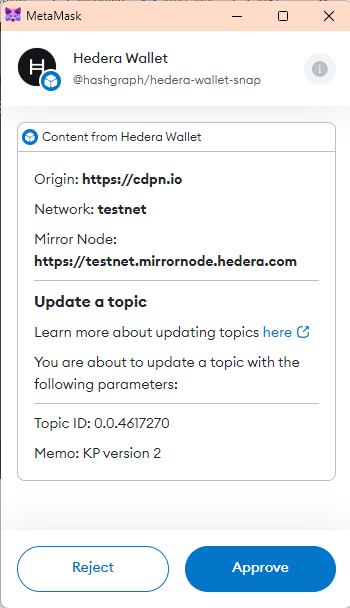

# hts/updateTokenFeeSchedule

## How to call the API from an app

Hedera Wallet Snap connects to your currently connected Metamask account by default. To learn how apps can connect to Hedera Wallet Snap using a non-metamask(external) account, refer to this [documentation](../#connecting-to-a-non-metamask-external-account).&#x20;

Then, depending on whether you're trying to connect to a metamask account or a non-metamask account, you can call the snap API in the following way:

```tsx
const snapId = `npm:@hashgraph/hedera-wallet-snap`

const initiateSwapAPI = async () => {
  const externalAccountParams = {
    externalAccount: {
      accountIdOrEvmAddress: '0.0.12345',
      curve: 'ED25519'
    }
  }

  const tokenCustomFee = {
    feeCollectorAccountId: '0.0.35453',
    hbarAmount?, // Optional param - type number - Set the amount of HBAR to be collected
    tokenAmount?, // Optional param - type number - Sets the amount of tokens to be collected as the fee
    denominatingTokenId?, // Optional param - type string - The ID of the token used to charge the fee. The denomination of the fee is taken as HBAR if left unset
    allCollectorsAreExempt?, // Optional param - type boolean - If true, exempts all the token's fee collector accounts from this fee
  }

  await window.ethereum.request({
    method: 'wallet_invokeSnap',
    params: {
      snapId,
      request: {
        method: 'hts/updateTokenFeeSchedule',
        params: {
          network: 'testnet',
          tokenId: '0.0.4535645',
          customFees: [tokenCustomFee],
          /* 
            Uncomment the below line if you want to connect 
            to a non-metamask account
          */
          // ...externalAccountParams
        }
      }
    }
  })
}
```


You must call this API with the account that has the ability to update token fee schedule. This is defined during account creation with `feeSchedulePublicKey` parameter.


## What the API does

1. Retrieves the currently connected account the user has selected on Metamask. If it's the first time, a new [snap account](../../snap-account.md) is created and the account info is saved in snap state.
2. Parses the arguments that were passed
3. Calls the [Hedera Token Update Token Fee Schedule API](https://docs.hedera.com/hedera/sdks-and-apis/sdks/token-service/update-a-fee-schedule) to update the custom fees for a given token. If the token does not have a fee schedule, the network response returned will be CUSTOM\_SCHEDULE\_ALREADY\_HAS\_NO\_FEES. You will need to sign the transaction with the fee schedule key to update the fee schedule for the token.
4. This action cannot be called if this token was created without passing the `feeScheedulePublicKey` parameter. Furthermore, this action must also be called using the same public key account.
5. Returns the transaction receipt as response


<figure><figcaption></figcaption></figure>

An example response:

```json
{
    "currentAccount": {
        "metamaskEvmAddress": "0x0b3628d1b838993b5fceec8b2a26502e7a8e5241",
        "externalEvmAddress": "",
        "hederaAccountId": "0.0.3581604",
        "hederaEvmAddress": "0xca53f9c93d30e0b7212d67901e5a24fb090d542b",
        "publicKey": "0x0206022cea4c6dd6d2e7263b8802253971de922f5380661d97cba82dee66f57ad6",
        "balance": {
            "hbars": 88.13421155,
            "timestamp": "Fri, 26 Apr 2024 17:50:12 GMT",
            "tokens": {
                "0.0.4279119": {
                    "balance": 50,
                    "decimals": 1,
                    "tokenId": "0.0.4279119",
                    "name": "NewTuum",
                    "symbol": "NEWTUUM",
                    "tokenType": "FUNGIBLE_COMMON",
                    "supplyType": "INFINITE",
                    "totalSupply": "50",
                    "maxSupply": "0"
                }
            }
        },
        "network": "testnet",
        "mirrorNodeUrl": "https://testnet.mirrornode.hedera.com"
    },
    "receipt": {
        "status": "SUCCESS",
        "accountId": "",
        "fileId": "",
        "contractId": "",
        "topicId": "",
        "tokenId": "",
        "scheduleId": "",
        "exchangeRate": {
            "hbars": 30000,
            "cents": 333977,
            "expirationTime": "Fri, 26 Apr 2024 20:00:00 GMT",
            "exchangeRateInCents": 11.132566666666667
        },
        "topicSequenceNumber": "0",
        "topicRunningHash": "",
        "totalSupply": "0",
        "scheduledTransactionId": "",
        "serials": [],
        "duplicates": [],
        "children": []
    }
}
```

## Live Demo on CodePen



<details>

<summary>Some things to keep in mind while interacting with the above demo</summary>

* If you're getting any errors with the live demo, make sure you go through the [FAQs](../../../basics/faqs.md) section to learn about what you may be missing. You need to install [Metamask](https://metamask.io/) in your browser for the live demo to work

</details>


To ease the integration of Hedera Wallet Snap on an application, we have created a template web application that you can run locally and check out the code in its entirety to learn how you can integrate and interact with various APIs exposed by Hedera Wallet Snap. Check out the full source code at [template application github repository](https://github.com/hashgraph/hedera-metamask-snaps/tree/main/packages/hedera-wallet-snap/packages/site).

You can also check out the [API reference](../) to learn how each API works.

